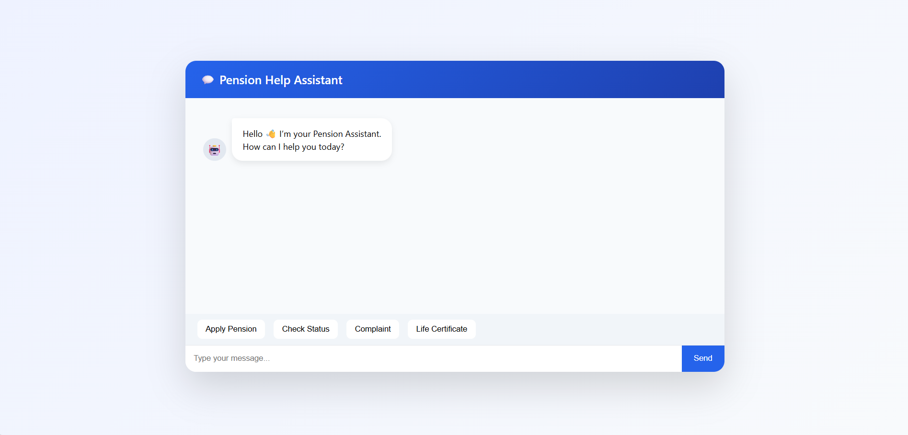

# 🏦 Pension Tracking & Alert Notification System

A secure web-based pension management system built using PHP and MySQL with dual OTP authentication, admin monitoring, and automated notification features.

---

## 🚀 Key Features

- 🔐 Secure User Registration with Email OTP Verification
- 🔑 Secure Login with Separate Login OTP Layer
- 👨‍💼 Admin Dashboard for Pension Management
- 📊 Pension History Tracking (Monthly Records)
- 📧 Automated Email Notifications (Registration, Login, Pension Credit)
- 📝 Activity Logging System
- 🛡 Session Management & OTP Expiry Validation
- 📂 Structured Database Design

---

## 🏗 System Architecture

Client (Browser)  
⬇  
PHP Backend  
⬇  
MySQL Database  
⬇  
Email Notification Layer  

Authentication Layer:
- Registration OTP
- Login OTP
- Expiry Validation
- Session Control

---

## 🛠 Tech Stack

- PHP (Core PHP)
- MySQL
- HTML / CSS
- JavaScript
- PHPMailer
- XAMPP

---

## 🚀 Challenges Solved

- Implemented Dual OTP Authentication System
- Resolved OTP mismatch between login & registration
- Fixed database synchronization issues
- Handled session conflicts during authentication
- Implemented OTP expiry validation logic
- Designed admin-level pension management system

---

## 📊 Project Metrics

- 10+ Database Tables
- 20+ Backend PHP Modules
- Multi-layer Authentication
- Real-time Email Notification System

---

## ⚙ Setup Instructions

1. Clone the repository
2. Import `pension_system.sql` into MySQL
3. Configure database in `db.php`
4. Configure email credentials in `send_mail.php`
5. Run using XAMPP (Apache + MySQL)

---

---

## 🖥 Application Screenshots

### 🔐 Login Page
Secure login interface with OTP-based authentication.

### 👨‍💼 Admin Dashboard
Admin overview panel with system statistics.

### 👤 Admin - View User Dashboard
Admin monitoring user dashboard activity.

### 👤 Admin - View User Profile
Admin viewing detailed pensioner profile.

### 👥 Admin Manage Users
User management interface for administrators.

### 📊 Admin View Charts
Data visualization and reporting dashboard.

### 📄 Life Certificate Management
Admin verification of life certificates.

### 🤖 Chatbot Feature
Integrated chatbot support system.

### 🗄 Backend Database Tables
Database structure overview.

---

## 👤 User Dashboard & Features

### 📊 User Dashboard Overview

---

### 📝 Apply for Pension
User pension application submission interface.

---

### 📜 Pension History View
User can track monthly credited pension history.

---

### 💬 Raise Complaint
Complaint submission and tracking feature.

---

## 📈 Analytics & Reporting

### 📊 Power BI Dashboard Integration
Advanced analytics and reporting view.

---

### 📑 Tax Summary View
Tax calculation and pension breakdown summary.

---

### 🔔 Send Alert Message
Admin sending pension alerts & notifications.

---

### 🔄 Update Pension Record
Admin pension update functionality.

## 👩‍💻 Developed By

Thinzar Aung
